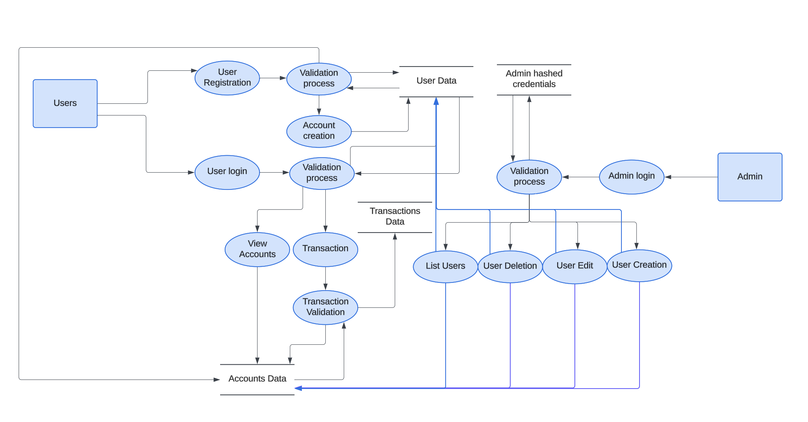

# 🚀 **SafeBank Data Flow Description**

This data flow diagram illustrates the interactions between **Users** 👤, **Admin** 🛠️, and the system's backend processes to handle key functionalities like user registration, account management, transactions, and administrative actions.

---

## 🌟 **1. Users' Interactions**
### 👤 **1.1 User Registration**
- **📋 Process**: Users initiate the registration process.
- **✅ Validation**: Submitted data undergoes a validation process to ensure accuracy and completeness.
- **🎉 Outcome**: Successful validation results in account creation and storage of user data.

### 🔐 **1.2 User Login**
- **📋 Process**: Users input their credentials to log in.
- **✅ Validation**: Credentials are validated against the stored user data.
- **🎉 Outcome**: Successful login grants users access to their accounts and the ability to initiate transactions.

### 🗂️ **1.3 View Accounts**
- **📋 Process**: Logged-in users can view their account details.
- **📚 Data Source**: Account data retrieved from the system database.

### 💸 **1.4 Transactions**
- **📋 Process**: Users can initiate transactions from their accounts.
- **🔍 Transaction Validation**:
  - Ensures the transaction complies with the system rules (e.g., sufficient funds).
  - Valid transactions are processed and stored in the transactions database.

---

## 🛠️ **2. Admin's Interactions**
### 🔐 **2.1 Admin Login**
- **📋 Process**: Admins log in using hashed credentials.
- **✅ Validation**: The system verifies admin credentials against stored admin data.
- **🎉 Outcome**: Successful login enables access to administrative functionalities.

### 📂 **2.2 Administrative Functions**
Admin tasks include:
- **👥 List Users**: Retrieve and display user details.
- **❌ User Deletion**: Remove a user from the system.
- **✏️ User Edit**: Update user details.
- **➕ User Creation**: Manually create a new user account.

#### 🔒 **Data Handling**:
- Admin actions are validated and logged for security.
- Changes affect the respective user data or accounts data stored in the system.

---

## ⚙️ **3. System Processes**
### 🛡️ **3.1 Validation Processes**
- Ensures data integrity and compliance for both users and admin actions.
- Prevents unauthorized or invalid operations.

### 📚 **3.2 Data Handling**
- **User Data**: Stores user credentials and account information.
- **Accounts Data**: Holds details of all user accounts.
- **Transactions Data**: Maintains records of completed transactions.

### 📊 **3.3 Monitoring and Feedback**
- Logs and monitors system operations, including validation results and transaction processing.

---

## 📝 **4. System Flow Summary**
1. 🧑‍💻 **Users and admins interact** with the system through login and specific operations.
2. 🔍 **Data validation ensures** the accuracy and integrity of every process.
3. 📂 **Key data** (e.g., user accounts and transactions) is securely stored and updated based on system actions.
4. 🛡️ **Admin functions** provide control over user and account management.

---

### 🎨 **Key Features**
- 🟢 **Clear visuals** of the data flow.
- 🔵 **Interactive elements** ensure smooth user and admin experiences.
- 🟡 **Secure and reliable** backend processes.
- 🔴 **Efficient monitoring** for system optimization.

---

Let me know if you need further enhancements or adjustments! 🚀
