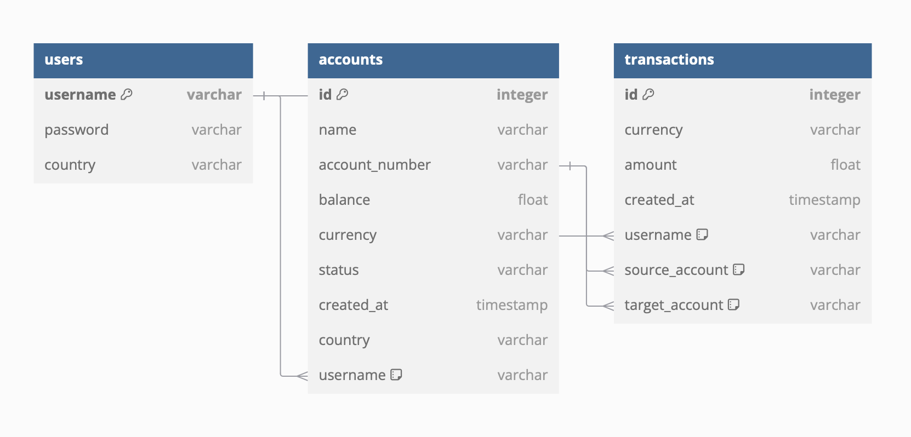

# 📊 Entity-Relationship Diagram Documentation

## Overview of the ER Diagram

This ER diagram models a relational database for a system that manages **Users**, their **Accounts**, and the **Transactions** they perform. It is designed to facilitate robust user account management, multi-currency support, and detailed transaction tracking. The relationships between entities ensure consistency and provide a clear structure for data retrieval and manipulation.

---

## Detailed Explanation of Entities and Attributes

### 1. **Users** 👤
- **Attributes**:
  - `username` (Primary Key): A unique identifier for each user. This key establishes a direct connection between the user and their accounts, as each account is linked to a specific `username`.
  - `password`: Stores the hashed password for secure user authentication.
  - `country`: Indicates the user's country of residence, which can be used for regional account configurations or compliance purposes.

- **Context and Relationships**:
  - Each user can own **multiple accounts**. This is represented through the `username` attribute in the **Accounts** table, which acts as a foreign key referencing the `username` in **Users**.
  - The connection between users and accounts allows the system to manage personalized account details, making it easy to query all accounts associated with a particular user.

---

### 2. **Accounts** 💳
- **Attributes**:
  - `id` (Primary Key): A unique identifier for each account. This ensures every account is distinctly identifiable.
  - `name`: The user-defined name of the account (e.g., "Savings Account" or "Business Account").
  - `account_number`: A unique number used for transactions and external references.
  - `balance`: The current monetary value in the account. This attribute tracks the user's funds and is frequently updated during transactions.
  - `currency`: Specifies the currency type (e.g., USD, EUR) associated with the account, allowing support for multi-currency systems.
  - `status`: Represents whether the account is active, inactive, or closed.
  - `created_at`: Records the timestamp when the account was created, useful for auditing and history tracking.
  - `country`: Indicates the account's country, which might differ from the user's residence in certain cases (e.g., offshore accounts).
  - `username` (Foreign Key): Links each account to a specific user by referencing the `username` attribute in the **Users** table.

- **Context and Relationships**:
  - An account belongs to **one user**, as enforced by the `username` foreign key. This ensures that all accounts are tied to a specific user in the **Users** table.
  - Each account can participate in **multiple transactions**, either as the `source_account` or `target_account`. This is managed through foreign key references in the **Transactions** table, where each transaction can identify the accounts involved.

---

### 3. **Transactions** 💸
- **Attributes**:
  - `id` (Primary Key): A unique identifier for each transaction. This is critical for tracking and auditing purposes.
  - `currency`: The currency type used in the transaction, which must match the account's currency.
  - `amount`: The monetary value of the transaction.
  - `created_at`: A timestamp indicating when the transaction occurred.
  - `username` (Foreign Key): Identifies the user who initiated the transaction by referencing the `username` in the **Users** table.
  - `source_account` (Foreign Key): Refers to the account from which the funds were withdrawn. This attribute links back to the `account_number` in the **Accounts** table.
  - `target_account` (Foreign Key): Refers to the destination account where the funds were deposited, also linking back to the `account_number` in the **Accounts** table.

- **Context and Relationships**:
  - Each transaction is initiated by a **single user**, represented by the `username` foreign key. This allows the system to trace transaction origins back to the user level.
  - Transactions involve **two accounts**: the `source_account` and the `target_account`. Both attributes reference the `account_number` in the **Accounts** table, ensuring that the involved accounts are valid and exist in the system.
  - By linking transactions to both users and accounts, the system can produce detailed reports on user activity, account balances, and transaction histories.

---

## Summary 📝

This database design ensures a robust connection between users, accounts, and transactions:
1. **Users manage multiple accounts**: Each account is uniquely linked to one user, but a single user can have many accounts, facilitating multi-account management.
2. **Accounts participate in transactions**: Every transaction must involve two accounts—one as the source and one as the target. Transactions are also tied to the user who initiated them, ensuring accountability.
3. **Scalable and relational structure**: The use of primary and foreign keys ensures strong referential integrity, making the database scalable and secure for future features such as transaction categorization, advanced reporting, or multi-user permissions.

---

