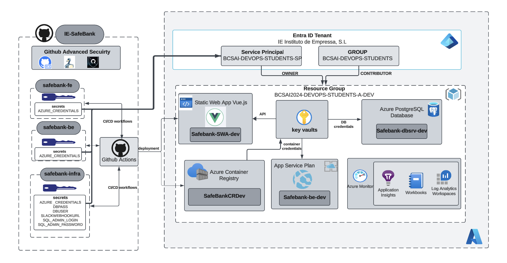
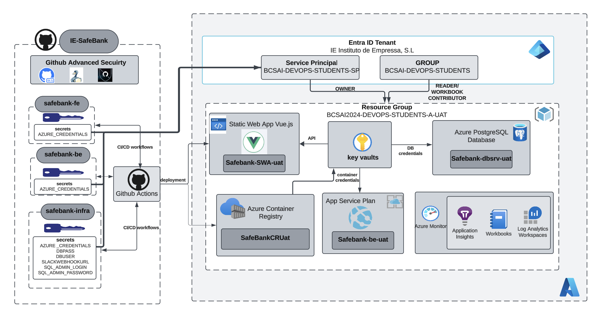
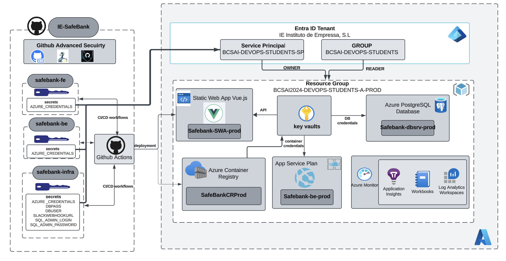

# **SafeBank Infrastructure Architecture Design**  
_A Journey to Scalable and Reliable Banking_ 🌍✨

At **SafeBank**, our goal is to create a seamless, secure, and scalable banking platform for users. To achieve this, we embraced modern **DevOps** practices and the **Well-Architected Framework** principles from Microsoft. One of our critical design decisions was to divide the infrastructure into three distinct environments—**_Development_**, **_UAT_**, and **_Production_**—to enable **continuous integration and continuous delivery** (**CI/CD**) while ensuring a safe and efficient pipeline from idea to implementation.

---

## **Why Divide the Environments?**

The separation of environments was not merely a technical requirement but a strategic decision aimed at ensuring **SafeBank** evolves into a robust banking system. By isolating workloads into **Development**, **UAT**, and **Production** environments:

1. **_Development_** serves as a 🧪 _sandbox_ for our developpers to experiment, innovate, and build new features without risking any production data or disrupting ongoing services.  
   

2. **_UAT (User Acceptance Testing)_** was introduced as a middle ground 🛠️ to validate functionality and ensure quality. Here, features are rigorously tested against real-world scenarios, ensuring stability and compliance before deployment to production.  
   

3. **_Production_**, as the final and live environment, focuses on delivering a flawless experience to end users with high availability, security, and performance as its core objectives.  
   

This **layered approach** ensures that every change is tested and validated at multiple stages, reducing the risk of errors and downtime while fostering a culture of **continuous improvement**.

---

## **Building the SafeBank Architecture**

The **SafeBank infrastructure** leverages **Azure services** to ensure **scalability**, **reliability**, and **security**, with CI/CD pipelines seamlessly integrating these components. Each service was chosen with careful consideration of its role in our system's success.

### **GitHub and CI/CD Workflows**  
🚀 **GitHub** serves as the foundation of our development process, providing a centralized platform for code versioning and collaboration. By integrating **CI/CD workflows** using GitHub Actions, we have automated our deployment pipeline across all environments. This ensures that every change is reviewed, tested, and deployed seamlessly, adhering to **DevOps best practices**.

🛡️ To secure our codebase and workflows, we leverage **GitHub Advanced Security**, which includes:  
- **CodeQL**: A powerful static analysis tool that scans our codebase for vulnerabilities and security issues. By incorporating CodeQL into our CI/CD pipelines, we proactively identify and resolve potential threats before they reach production.  
- **Dependency Scanning**: Automatically scans dependencies in our repositories, alerting us to known vulnerabilities and suggesting fixes.  
- **Secret Scanning**: Ensures that sensitive information, such as credentials or keys, does not accidentally get exposed in the codebase.  
- **Branch Protection Rules**: Safeguards our repositories by requiring code reviews and successful CI checks before merging changes.  

---

### **Azure App Services**  
💻 At the heart of **SafeBank** lies **Azure App Services**, hosting our containerized backend APIs. The **App Services tier** remains consistent across all environments, ensuring parity in functionality and scalability. This decision was intentional—to minimize discrepancies and potential failures when promoting workloads from one environment to another.

---

### **Azure Static Web Apps**  
🌐 The frontend of SafeBank, built using **Vue.js**, is hosted on **Azure Static Web Apps**. This service delivers lightning-fast performance 🚀 and automatic scaling, ensuring our users experience a smooth interface. Each environment has its own Static Web App instance, maintaining strict separation of workloads.

---

### **Azure PostgreSQL Database**  
🗂️ The backbone of our data infrastructure is **Azure PostgreSQL**. Each environment has its own database instance, isolating data and ensuring security 🔐. Credentials for database access are securely managed via **Azure Key Vault**, reflecting our commitment to **data protection**.

---

### **Azure Container Registry**  
📦 To streamline the deployment process, containerized backend images are stored in **Azure Container Registry (ACR)**. This ensures a **secure** and centralized location for all container images, simplifying the CI/CD workflow.

---

### **Azure Key Vault**  
🔑 Sensitive information such as database credentials, API keys, and other secrets are stored in **Azure Key Vault**. This centralization ensures a **consistent** and **secure approach** to secret management across all environments.

---

### **Monitoring and Observability**  
📊 SafeBank's architecture includes **comprehensive monitoring** and observability through:  
- **Azure Monitor**  
- **Application Insights**  
- **Log Analytics Workspace**  

These tools empower us to track application health, diagnose issues, and optimize performance effectively.

---

## **Environment-Specific Configurations**

While the core architecture remains consistent across environments, permissions and access control vary to align with the purpose of each environment:

### **Development Environment**  
- 🧪 The **Development environment** is designed as a playground for developpers, allowing them to innovate and implement new features.  
- Contributors have **full access** to Azure resources, enabling rapid prototyping.  
- Logs and metrics collected in this environment focus on debugging rather than long-term insights.

---

### **UAT Environment**  
- 🛠️ **UAT** bridges the gap between development and production. It mimics production as closely as possible, enabling rigorous functional testing.  
- Here, we execute **functional tests** using tools like **Postman** to validate APIs and ensure readiness for deployment.  
- Access is more restrictive, with students being **readers** and only contributors for workbooks, focused on testing rather than modifying resources.

---

### **Production Environment**  
- In **Production**, stability and security are paramount.  
- **Permissions are restricted** to minimize risks, with only essential contributors granted access.  
- Monitoring is enhanced to include **real-time alerts** and **in-depth diagnostics**, ensuring uninterrupted service for our users.

---

## **Conclusion**

**SafeBank’s infrastructure** reflects our commitment to delivering a world-class banking solution for users. By dividing our environments and leveraging **Azure’s robust services**, we have built a scalable, secure, and efficient platform. Each environment plays a crucial role in our CI/CD pipeline, ensuring every feature we develop is tested and optimized before reaching our end users.  

With these principles in place, SafeBank is ready to meet the demands of today and the challenges of tomorrow. 🌟🚀
