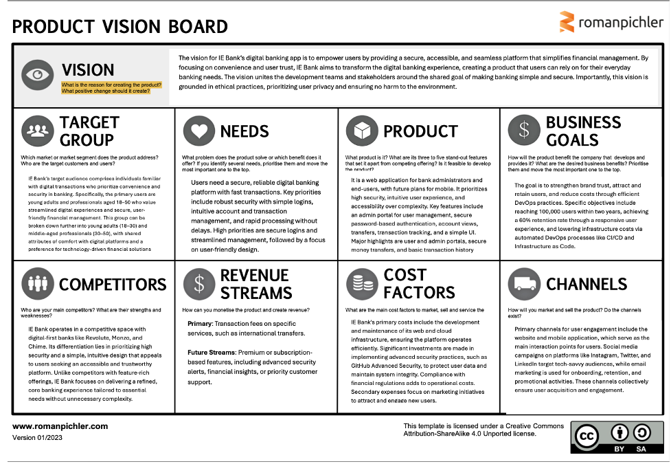

# Product Vision Statement & Product Mission Statement

The vision for the IE Bank digital banking platform is to create a secure, accessible, and seamless banking experience that empowers users to manage their finances effortlessly. Our aim is to establish IE Bank as a trusted partner for digital banking by prioritizing user convenience, security, and transparency, while fostering sustainable and ethical development practices.

Our mission is to deliver a robust digital banking solution that simplifies financial management for individuals and businesses. By integrating advanced security measures, intuitive interfaces, and efficient operational frameworks, we seek to enhance user satisfaction and contribute to the modernization of digital banking. This mission reflects our commitment to addressing the needs of tech-savvy users while maintaining high standards for data security, user privacy, and accessibility.

---

## Detailed Vision Board

### Product Vision Statement

The vision of IE Bank's digital banking platform is to redefine financial management through a secure, accessible, and seamless digital experience. By focusing on user trust and convenience, IE Bank seeks to transform banking into an intuitive, user-centric activity that simplifies everyday transactions. Our ultimate goal is to establish IE Bank as a trusted, sustainable, and leading digital banking solution for tech-savvy users.

### Concise Vision Statement
*"Your bank, anywhere, anytime—banking redefined."*

This vision is built on six core principles:
- **Inspiring**: Empower users with intuitive, secure, and accessible digital banking tools.
- **Shared**: Aligns teams and stakeholders on delivering a seamless financial management platform.
- **Ethical**: Upholds user privacy and security, with no environmental impact.
- **Concise**: A simple, relatable goal for positioning IE Bank in the digital space.
- **Ambitious**: Aims to become the preferred banking app for digital-first customers.
- **Enduring**: Guides adaptive product development over 5–10 years.

---

## Target Audience

### Demographics
- **Primary Market**: Young adults (18–30) and professionals (30–50) who are comfortable with digital platforms.
- **Specific Needs**: Security, convenience, and user-friendly design for streamlined financial management.

### Behavioral Insights
- These users prioritize technology-driven solutions and expect simple, efficient banking operations.
- Surveys indicate that **73% of millennials** prefer banking apps that emphasize intuitive navigation and secure transactions.

### Market Size
The global digital banking market was valued at **$15 billion in 2022** and is expected to grow at a **CAGR of 13.6%**, reaching **$35 billion by 2028**.

---

## Core User Needs

1. **Security**: Robust protection against breaches, simple and reliable authentication methods.
2. **Efficiency**: Rapid processing of transactions, ensuring no hidden delays.
3. **Usability**: A clean, intuitive interface for seamless account and transaction management.

### Prioritization:
- **High Priority**: Secure login, streamlined account views, and transaction tracking.
- **Medium Priority**: Customizable account alerts and user-friendly features for financial insights.

---

## Competitor Landscape

IE Bank competes with major digital-first players like:
1. **Revolut**: A fintech giant offering multi-currency accounts but with frequent complaints about support.
2. **Monzo**: Popular in the UK but lacks robust business account features.
3. **Chime**: Known for simplicity but criticized for limited international support.

### Competitive Edge
IE Bank focuses on a core set of high-priority banking needs, providing unmatched security and streamlined interfaces. Unlike competitors offering expansive yet complex features, IE Bank ensures usability without sacrificing functionality or privacy.

---

## Product Overview

### Type
A web-based digital banking solution with plans for mobile integration.

### Core Features
1. **Admin Portal**: Comprehensive tools for user and account management.
2. **User Authentication**: Encrypted, password-based logins ensuring data security.
3. **Transaction Management**: Simplified money transfers and transaction history tracking.

### Key Differentiators
- **High-security architecture** with real-time fraud detection.
- **Transparent and minimalistic UI** designed for non-technical users.
- **Scalable platform** capable of handling 10,000 concurrent users.

---

## Business Goals

### Outcome-Based Objectives
1. Achieve **100,000 users** within two years by targeting tech-savvy demographics.
2. Implement CI/CD pipelines to reduce deployment costs by **30%**.
3. Increase retention rates to **60%** through superior user experiences.

### Market Potential
By **2026**, **58% of all banking transactions** are expected to occur digitally, highlighting the urgency of digital transformation.

---

## Revenue Streams

1. **Primary Stream**: Transaction fees on premium services like international transfers.
2. **Future Opportunities**: Subscription-based models for advanced features like budgeting tools, financial insights, and priority support.

---

## Cost Structure

### Primary Costs
- **Infrastructure**: Hosting secure and scalable cloud-based systems.
- **Compliance**: Meeting financial regulatory standards globally.
- **Security**: Annual investment in GitHub Advanced Security tools.

### Secondary Costs
- **Marketing**: Targeted campaigns on LinkedIn, Instagram, and Twitter.
- **User Support**: Providing efficient resolution systems to improve retention.

---

## Channels

1. **Primary**:
   - Website and mobile application as core user interaction points.
   - Social media for engagement and acquisition.
2. **Secondary**:
   - Partnerships with local financial institutions for credibility.
   - Incentive programs encouraging referrals.

---

## Market Opportunity

### Global Digital Shift
- In **2023**, **78% of financial institutions** invested in digital transformation strategies, signaling a competitive yet promising market.

### IE Bank’s Value Proposition
- Delivering simplicity in a cluttered market of over-featured apps.
- Combining high-security infrastructure with user-centric design to capture and retain loyal customers.

---

## Minimum Viable Product (MVP)

The MVP for IE Bank focuses on building the foundation of a secure, user-friendly digital banking system. This platform will serve as a central hub for essential banking activities for end users and administrators, aligning with rigorous security, performance, and compliance standards.

### Core Functional Requirements
1. **Landing Page and Navigation**:
   - Users access a landing page with three options: “New User,” “Log In,” and “I am an Admin.”
   - Clear navigation ensures ease of access for all users.
2. **User Registration and Profile Creation**:
   - New users can register by providing basic details (username and password).
   - Successful registration generates a unique bank account number.
3. **Account Management Portal**:
   - Users can log in to view account details, transaction histories, and perform essential actions like transfers.
   - Secure login ensures data protection.
4. **Admin User Management**:
   - Admins can log in to manage users, create accounts, update profiles, and audit user activities.
5. **Money Transfer Capability**:
   - Users can securely transfer funds with real-time error checks (e.g., insufficient balance).
6. **Session Management and Security**:
   - Secure logouts and encrypted sessions using **SHA-256 hashing**.

---

## Non-Functional Requirements

- **Authentication**: All data transfers are HTTPS-encrypted.
- **Performance**: Processes like logging in or transferring funds are completed in under 2 seconds under normal load.
- **Compatibility**: Optimized for modern browsers like Chrome and Firefox.
- **Reliability**: Maintains 99% uptime with real-time monitoring.
- **System Monitoring**: Automated alerts for incident responses via Azure Monitor and Slack.

---

## Documentation and Deployment
- **GitHub Pages** will host detailed design documentation for team collaboration.
- **Azure DevOps** will manage product backlogs and sprint planning.
