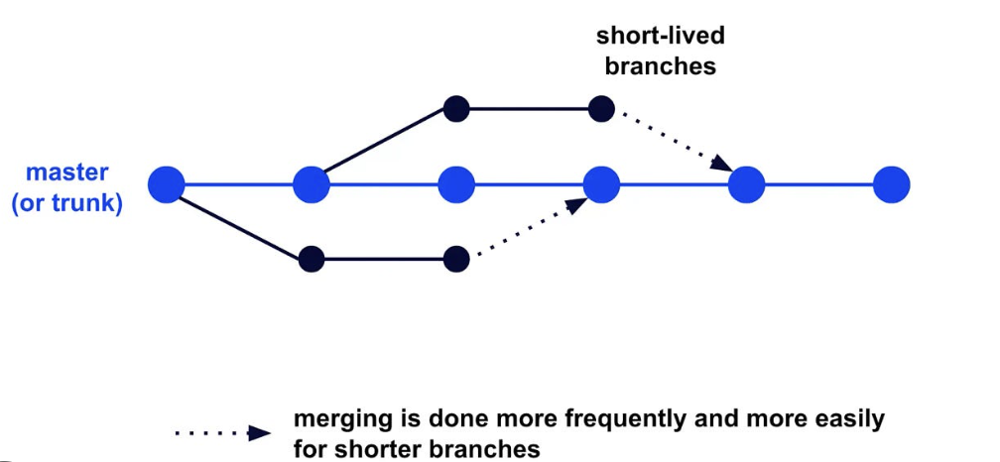

# 🚀 **SafeBank Release Strategy**

---

## **1. Overview**
SafeBank’s release strategy is designed to deliver **rapid**, **reliable**, and **secure** software deployments. Leveraging principles from **Microsoft’s Well-Architected Framework** and **DevOps culture**, this strategy integrates **industry best practices** for operational excellence, ensuring superior software delivery and user satisfaction.

---

## 🎯 **2. Goals of the Release Strategy**
- **Deliver Value Faster:** Employ streamlined CI/CD pipelines to ensure features are delivered swiftly and efficiently.
- **Optimize Quality:** Integrate comprehensive testing and quality checks at every stage of development to minimize errors and enhance performance.
- **Maximize Security:** Embed security into all stages of the software lifecycle to safeguard sensitive data and prevent vulnerabilities.
- **Scale with Confidence:** Develop a robust release system that adapts to SafeBank's expanding user base and evolving business requirements.

---

## 🛠️ **3. Environment Design**
SafeBank adopts a **DTAP** (Development, Testing, Acceptance, Production) model, enabling seamless transitions and thorough validations across environments. You can check ou environment Design in more depth in our 

### 3.1. **Development Environment (DEV)**
- **🎯 Purpose:** Supports feature development and testing by developers.
- **Key Features:**
  - Hosted in the **BCSAI-DEVOPS-STUDENTS-A-DEV Azure resource group** with contributor permissions.
  - CI/CD pipelines trigger automated builds and deployments after feature branch pushes.
  - Integrated with **Azure Monitor** to capture metrics and logs for immediate feedback.

### 3.2. **Testing/UAT Environment (UAT)**
- **🎯 Purpose:** Mimics production for final validation by stakeholders.
- **Key Features:**
  - Hosted in the **BCSAI-DEVOPS-STUDENTS-A-UAT Azure resource group** with reader permissions.
  - Deployments triggered by pull request merges to the main branch.
  - Integrated with automated functional and integration testing using tools like **Postman**.
  - Supports stakeholder feedback loops to validate user stories and non-functional requirements.

### 3.3. **Production Environment (PROD)**
- **🎯 Purpose:** Hosts the final stable version for end-users.
- **Key Features:**
  - Hosted in the **BCSAI-DEVOPS-STUDENTS-A-PROD Azure resource group** with high availability and reliability configurations.
  - Utilizes strict access policies and advanced monitoring through **Azure Application Insights**.

### 3.4. **Environment-Specific Configurations**
- **Frontend:** Deployed as a static web app (**Vue.js**) using **Azure Static Web Apps** for cost efficiency and performance.
- **Backend:** Hosted on Linux-based **Azure App Service** to enable scalable, containerized deployments.
- **Database:** Uses **Azure PostgreSQL** with advanced encryption and strict access policies.
- **Secrets Management:** **Azure Key Vault** ensures secure storage and automated credential rotation.
- **Monitoring:** Unified monitoring through **Azure Monitor** and **Log Analytics** for centralized observability.

---

## 🔄 **4. Continuous Integration and Deployment (CI/CD) Pipeline**

### 4.1. **Feature Branching Strategy**

- **🎯 Purpose:** Supports parallel development to reduce conflicts and accelerate feature delivery.
- **Implementation:**
  - Developers create short-lived feature branches, with automated builds and deployments triggered for each push.
  - Frequent merges into the main branch minimize integration challenges.

### 4.2. **Main Branch Protection**
- **🎯 Purpose:** Ensures stability and aligns with high-quality software delivery goals.
- **Policies:**
  - Mandatory reviews by at least two developers.
  - Automated checks for linting, testing, and security scanning.
  - No direct pushes to main; all changes must pass through PRs.

### 4.3. **Deployment Workflows**
- **🎯 Purpose:** Streamlined automation eliminates manual errors and shortens release cycles.
- **Implementation:**
  - **DEV Environment:** Triggered by feature branch pushes for early-stage validation.
  - **UAT Environment:** Deployments triggered by PR merges, validated through functional and integration testing.
  - **PROD Environment:** Manual approvals and performance monitoring ensure stable production releases.

---

## 🔐 **5. DevSecOps Practices**

### 5.1. **Secrets Management**
- **🎯 Purpose:** Prevent unauthorized access and protect sensitive data.
- **Implementation:**
  - **Azure Key Vault** securely stores secrets, API keys, and database credentials.
  - Seamlessly integrates with **GitHub Actions** for secure CI/CD workflows.

### 5.2. **Code Security**
- **🎯 Purpose:** Proactively address vulnerabilities during development.
- **Implementation:**
  - **Static Analysis:** CodeQL scans for vulnerabilities in both the frontend and backend.
  - **Push Protection:** Prevents accidental inclusion of sensitive information in repositories.
  - **Dependency Reviews:** Evaluates third-party libraries for security risks.

### 5.3. **Dependency Management**
- **🎯 Purpose:** Ensure up-to-date libraries for performance and security.
- **Implementation:**
  - Automated dependency updates with **Dependabot**.
  - Comprehensive security audits for all dependencies.

### 5.4. **Azure DevOps Integration**
- Used **Azure DevOps** for tracking work items, ensuring complete traceability from planning to deployment.
- Enabled **Slack notifications** for task updates, ensuring the team stayed informed.

---

## 🤝 **6. Team Collaboration and Well-Being**

### 🗣️ **Communication**
- Weekly **Scrum meetings** fostered alignment and transparency.
- **Slack channels** provided instant communication and collaboration.

### 💡 **Work-Life Balance**
- **Automation** reduced repetitive tasks, allowing the team to focus on innovation.
- Real-time **feedback loops** minimized stress during issue resolution.

---

## 📈 **7. Alignment with Microsoft’s DevOps Culture and Principles**
SafeBank’s release strategy aligns closely with **Microsoft’s Well-Architected Framework** and **DevOps culture** by emphasizing:
- **Automation:** CI/CD pipelines powered by **GitHub Actions** reduce lead time and human error.
- **Collaboration:** Stakeholder feedback in UAT ensures a user-centric approach.
- **Monitoring and Observability:** **Azure tools** provide actionable insights for performance and incident response.
- **Operational Excellence:** Proactive management of quality, scalability, and security ensures a reliable product.

---

## 🏆 **8. Why SafeBank’s Release Strategy is the Best**

- **📊 DORA Excellence:**
  - **Deployment Frequency:** Frequent deployments to DEV and UAT accelerate feedback.
  - **Change Failure Rate:** Advanced testing and canary deployment reduce failures.
  - **Lead Time for Changes:** Automated CI/CD minimizes delays.
  - **Mean Time to Recovery:** Real-time monitoring and automated rollback ensure swift issue resolution.
- **🔒 Security Leadership:** Proactive DevSecOps practices secure the pipeline and infrastructure.
- **📈 Scalability and Reliability:** Modular architecture supports growth without compromising performance.
- **🎯 User Focus:** Advanced deployment strategies ensure minimal disruption and superior experiences.

---

### **Resources Referenced:**
- Microsoft Well-Architected Framework for Operational Excellence
- Enable DevSecOps on Azure
