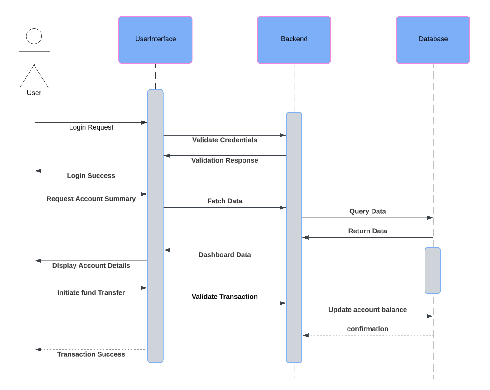
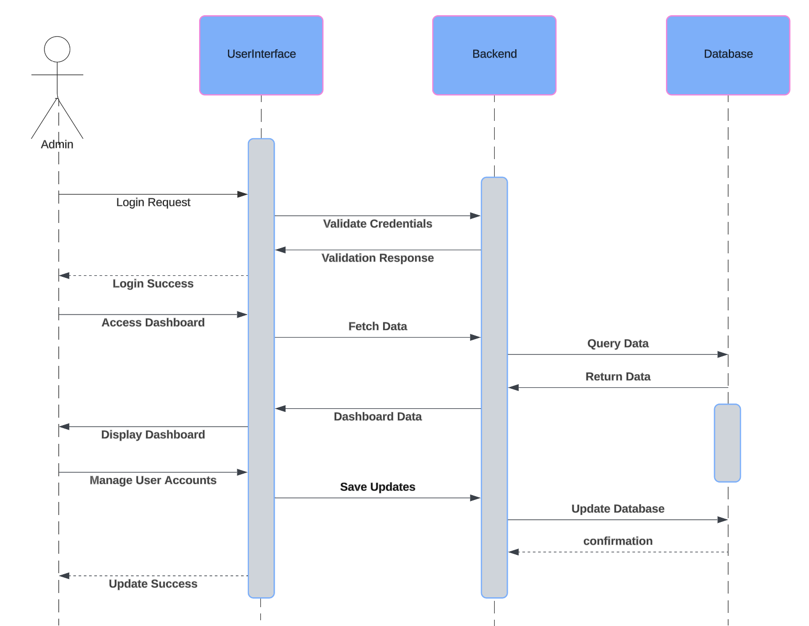

# ✨ **Sequence Diagram Documentation**

## 🌟 **Sequence Diagram 1: User Operations**

This diagram illustrates the flow of operations when a user interacts with the banking system.

### 📝 **Steps**:
1. **🔑 Login Request**:
   - The user initiates a login request via the User Interface.
   - The User Interface forwards the request to the Backend for validation.

2. **🔍 Validate Credentials**:
   - The Backend validates the provided credentials against the stored data in the Database.
   - The Database processes the query and returns the data to the Backend.

3. **✅ Validation Response**:
   - The Backend sends a validation response back to the User Interface.
   - If successful, the User Interface notifies the user with a "Login Success" message.

4. **📄 Request Account Summary**:
   - After logging in, the user requests an account summary.
   - The User Interface sends a request to the Backend to fetch the relevant account data.

5. **📂 Fetch Data**:
   - The Backend queries the Database for account details.
   - The Database retrieves and returns the requested data to the Backend.

6. **📊 Display Account Details**:
   - The Backend forwards the account data to the User Interface.
   - The User Interface displays the account details to the user.

7. **💸 Initiate Fund Transfer**:
   - The user initiates a fund transfer via the User Interface.
   - The User Interface sends the transaction request to the Backend for validation.

8. **🔐 Validate Transaction**:
   - The Backend validates the transaction and updates the account balance in the Database.
   - The Database confirms the update and sends a confirmation message to the Backend.

9. **🎉 Transaction Success**:
   - The Backend notifies the User Interface of the successful transaction.
   - The User Interface displays a "Transaction Success" message to the user.

---

## 🌟 **Sequence Diagram 2: Admin Operations**

This diagram showcases the flow of operations when an admin interacts with the banking system.

### 📝 **Steps**:
1. **🔑 Login Request**:
   - The admin initiates a login request via the User Interface.
   - The User Interface forwards the request to the Backend for validation.

2. **🔍 Validate Credentials**:
   - The Backend validates the provided credentials against the stored data in the Database.
   - The Database processes the query and returns the data to the Backend.

3. **✅ Validation Response**:
   - The Backend sends a validation response back to the User Interface.
   - If successful, the User Interface notifies the admin with a "Login Success" message.

4. **📋 Access Dashboard**:
   - After logging in, the admin accesses the dashboard.
   - The User Interface sends a request to the Backend to fetch dashboard data.

5. **📂 Fetch Data**:
   - The Backend queries the Database for the required data.
   - The Database retrieves and returns the requested data to the Backend.

6. **📊 Display Dashboard**:
   - The Backend forwards the dashboard data to the User Interface.
   - The User Interface displays the dashboard to the admin.

7. **🛠️ Manage User Accounts**:
   - The admin performs account management tasks (e.g., updating user details) via the User Interface.
   - The User Interface sends the update request to the Backend.

8. **💾 Save Updates**:
   - The Backend processes the update and applies the changes in the Database.
   - The Database confirms the update and sends a confirmation message to the Backend.

9. **🎉 Update Success**:
   - The Backend notifies the User Interface of the successful update.
   - The User Interface displays an "Update Success" message to the admin.

---
