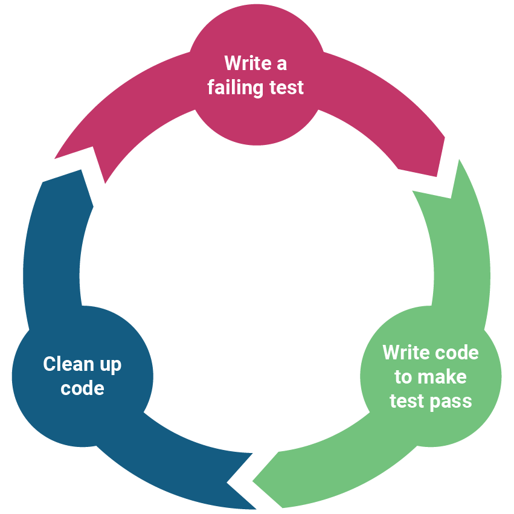

# TDD/BDD Strategy

1. **Test-Driven Development (TDD)**

1. Write tests
2. Tests Fail
3. Write Code
4. Tests Pass
5. Refactor

With this cycle, our team was able to produce clean, maintainable code. Saving time on bugs by catching them in early development, and ensure all feature requirements were met.

2. **Behavior-Driven Development (BDD)**

- Defined system behaviors in clear scenarios defined in a "Given, When, Then" Format.

3.  **Unit Tests**:

- Developed with **Pytest**, focusing on validating individual components.

4.  **Functional Tests**:

- Expanded with **Postman**, leveraging **Postbot** to validate end-to-end scenarios (e.g., user login, account management, and transaction processing) in the UAT environment.

5.  **Integration with CI/CD**:

- Functional tests are part of build and deployment workflows, with Github status checks configured so that only pull requests that pass all tests can be merged to main.
- Ensure high quality code from development to deployment.

---

Below are some examples of tests implemented for specific user storie found in `safebank-be/tests/functional/test_routes.py`:

| **User Story**                                                                                      | **Acceptance Criteria**                                                                                                                                                                                                                                                                              | **Related Tests**                                                                                                                                                                                                                                                                                                                                                                                |
| --------------------------------------------------------------------------------------------------- | ---------------------------------------------------------------------------------------------------------------------------------------------------------------------------------------------------------------------------------------------------------------------------------------------------- | ------------------------------------------------------------------------------------------------------------------------------------------------------------------------------------------------------------------------------------------------------------------------------------------------------------------------------------------------------------------------------------------------ |
| **215 Transfer Money**(https://dev.azure.com/rsagasteguiieu2022/safebank/_workitems/edit/215)       | **GIVEN** a transfer request **WHEN** - The source and target bank accounts exist - The source account belongs to the user - The amount to transfer is a non-negative floating-point number - The source account has sufficient balance **THEN** the transfer is made successfully | `test_transfer(...):` Test that a transfer between accounts of a user is made successfully `test_invalid_transfers(...):` Test that if amount is negative or too large, the transfer fails `test_transfer_between_users(...):` Test that a transfer between accounts of two different users is made successfully                                                                  |
| **165 Manage User Accounts**(https://dev.azure.com/rsagasteguiieu2022/safebank/_workitems/edit/165) | **GIVEN** valid admin credentials **WHEN** accessing the user management portal **THEN Admins can** - See a list of all users - See a list of all transactions - Create users - Update user information - Delete users                                                          | `test_create_user(...):` Test that a user is created successfully `test_get_users(...):` Test that a list of users can be retrieved `test_get_transactions(...):` Test that a list of transactions can be retrieved `test_update_user(...):` Test that a user’s country is updated successfully `test_delete_user(...):` Test that a user can be deleted successfully |
| **207 User Login**(https://dev.azure.com/rsagasteguiieu2022/safebank/_workitems/edit/207)           | **GIVEN** valid user credentials **WHEN** a user fills out the login form **THEN** the system will authenticate the user and redirect them to the user page **AND** if the credentials are invalid, the user should see an error message indicating the failure to authenticate             | `test_user_login(...):` Test that a user can log in successfully `test_unsuccessful_user_login(...):` Test that a user with invalid credentials cannot log in                                                                                                                                                                                                                           |

---
