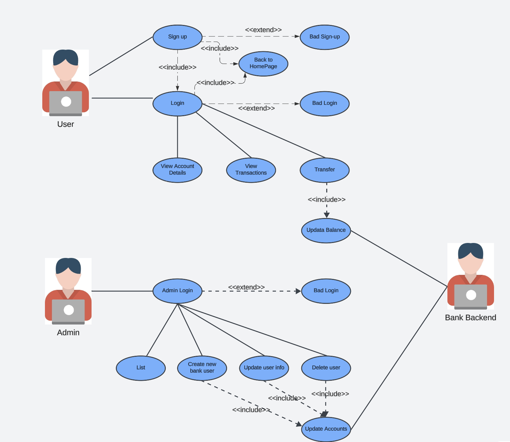

# 🎯 **Use Case Diagram**

---

## 🧑‍🤝‍🧑 **Actors**
- **👤 User**: Represents the bank customer who interacts with the banking system through a frontend application.
- **🛠️ Admin**: Represents the bank's administrator responsible for managing user accounts and performing backend operations.
- **💻 Bank Backend**: Represents the backend system that processes and stores all the banking operations.

---

## 🌟 **Use Cases for the User**

### 1. 🔑 Sign up
- **Description**: Allows new users to create an account.
- **Includes**: Redirects to the Home Page after successful sign-up.
- **Extends**: `Bad Sign-up` for scenarios where the user fails to provide valid information.

### 2. 🔐 Login
- **Description**: Enables users to log into their accounts.
- **Includes**: Redirects back to the Home Page upon successful login.
- **Extends**: `Bad Login` for scenarios where login credentials are incorrect.

### 3. 📋 View Account Details
- **Description**: Allows users to view their account information.

### 4. 📜 View Transactions
- **Description**: Enables users to view their transaction history.

### 5. 💸 Transfer
- **Description**: Allows users to transfer money between accounts.
- **Includes**: `Update Balance` to reflect changes after the transaction.

---

## 🌟 **Use Cases for the Admin**

### 1. 🔐 Admin Login
- **Description**: Allows administrators to access the system backend.
- **Extends**: `Bad Login` for incorrect login credentials.

### 2. 📋 List
- **Description**: Enables administrators to view a list of all users.

### 3. ➕ Create New Bank User
- **Description**: Allows administrators to add a new user to the banking system.

### 4. ✏️ Update User Info
- **Description**: Allows administrators to modify user details.
- **Includes**: `Update Accounts` to ensure all associated account details are consistent.

### 5. ❌ Delete User
- **Description**: Enables administrators to remove a user from the system.
- **Includes**: `Update Accounts` to ensure consistency after deletion.

---

## 🔄 **System Interactions**

### 1. 💵 Update Balance
- **Description**: Used when the user performs a transfer to ensure account balances are updated on the backend.

### 2. 🔄 Update Accounts
- **Description**: Triggered during user information updates or deletions to maintain data integrity.

---

## 📚 **Relationships**

### 🔗 **Includes**
- `Sign up → Back to Home Page`
- `Login → Back to Home Page`
- `Transfer → Update Balance`
- `Update User Info → Update Accounts`
- `Delete User → Update Accounts`

### 🔗 **Extends**
- `Sign up → Bad Sign-up`
- `Login → Bad Login`
- `Admin Login → Bad Login`

---
