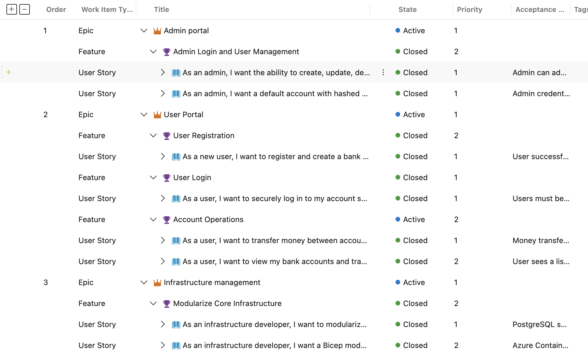
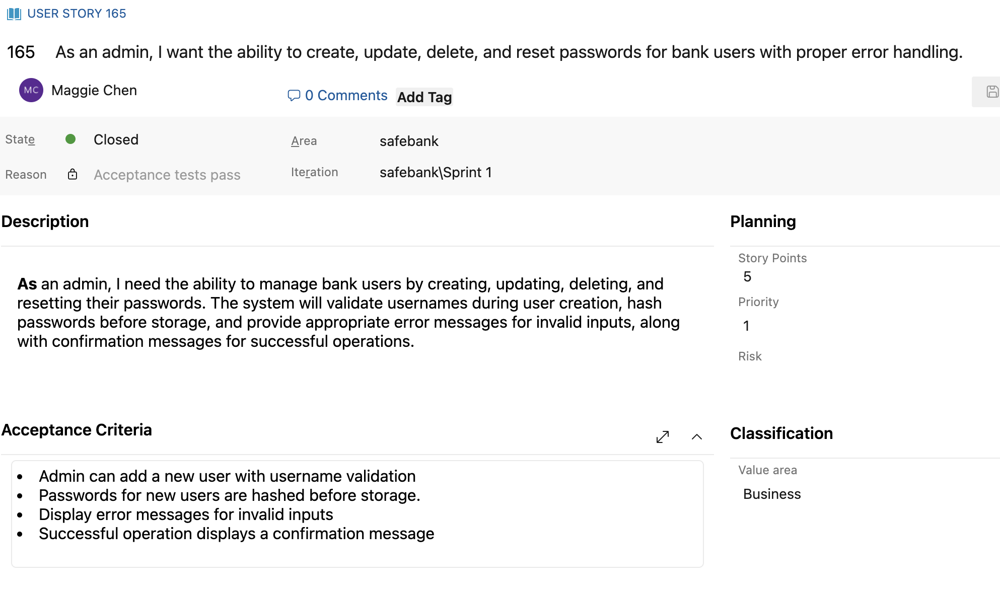

# ✨ **User Stories: A Cloud Architect’s Perspective**

As a Cloud Architect, my role in the SafeBank project extended far beyond designing the infrastructure—it required continuous collaboration with developers to ensure alignment between technical execution and business goals. Throughout the project, I actively reviewed, refined, and, when necessary, deleted user stories to maintain clarity and focus. This iterative process demanded a structured approach to organizing, prioritizing, and documenting user stories while addressing complexity and priorities effectively.

---

## 🚀 **Creating and Managing User Stories**

### **1. Dividing the User Stories**
To streamline development and maintain focus, user stories were divided into three levels:

- **📌 Epics**: Represented high-level goals such as the **Admin Portal**, **User Portal**, and **Infrastructure Management**.
- **📋 Features**: Subdivided Epics into tangible deliverables like "User Login" or "Modularize Core Infrastructure."
- **📝 User Stories**: Focused on specific user needs and followed a consistent format:
  - **Title**: "As a [user role], I want to [achieve a goal] so that [benefit is delivered]."

### **2. Prioritizing Complexity and Features**
- User stories were assigned a **priority** ranging from **1 (highest)** to **4 (lowest)** based on their business value and technical complexity.
- Given the critical nature of SafeBank’s features, the majority of user stories were prioritized between **1 and 2**, ensuring high-priority deliverables were tackled first.

---

## 🖋️ **Documenting User Stories**

Each user story was carefully documented to ensure clarity, alignment, and ease of execution.  

### **Key Components of Each User Story**
1. **📌 Title**: Clearly defined in the format, "As a [user role], I want to..."
2. **🛠️ Tasks**:
   - User stories were broken into smaller, actionable tasks to simplify execution.
   - Tasks were assigned to the appropriate team members, such as Infrastructure Developers or Scrum Masters.
3. **✅ Acceptance Criteria**:
   - Defined measurable criteria to verify when a story was complete.
   - Examples include:
     - "Admin can add a new user with username validation."
     - "Passwords for new users are hashed before storage."
     - "Error messages are displayed for invalid inputs."

---

## 📚 **Example User Stories**

### **Admin Portal**
#### **Epic**: Admin Portal
- **Feature**: Admin Login and User Management
  - **User Story**: 5
    - **Title**: "As an admin, I want the ability to create, update, delete, and reset passwords for bank users with proper error handling."
    - **🛠️ Tasks**:
      - Implement hashing for admin credentials.
      - Display error messages for invalid inputs.
    - **✅ Acceptance Criteria**:
      - Admin can add a new user with username validation.
      - Passwords for new users are hashed before storage.
      - Display error messages for invalid inputs.
      - Successful operations display a confirmation message.
    - **📊 Priority**: 1

---

## 🔄 **Refining the Backlog**

The backlog was a **living document**, continuously refined to reflect changing project needs:
- **💡 Dynamic Updates**: Stories were regularly revisited and refined during Sprint Planning and Retrospectives.
- **🗑️ Deleting User Stories**: Outdated or redundant stories were removed to maintain focus on high-priority tasks and ensure team efficiency.

---

## 🏆 **Key Takeaways**

Managing user stories as a Cloud Architect required:
1. **🤝 Continuous Collaboration**: Working closely with developers to align technical tasks with business goals.
2. **🎯 Attention to Detail**: Breaking down complex requirements into well-documented, actionable tasks.
3. **⚡ Agility**: Adapting to evolving requirements by refining the backlog and prioritizing effectively.

By following this structured approach to managing user stories, SafeBank successfully delivered a user-centric, secure, and scalable solution, aligned with both technical and business objectives.

---
